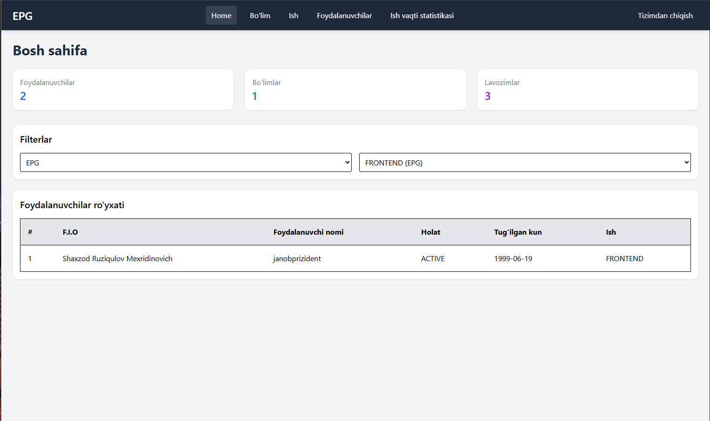
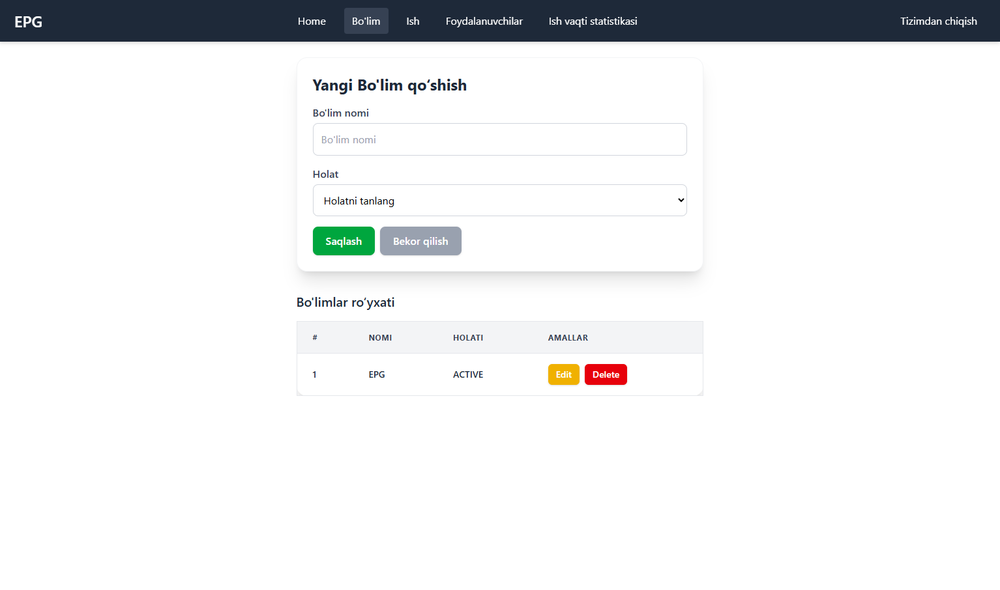
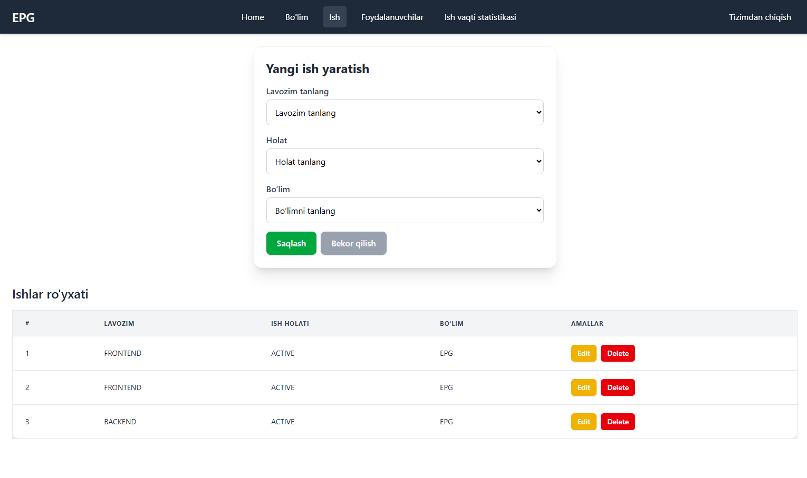
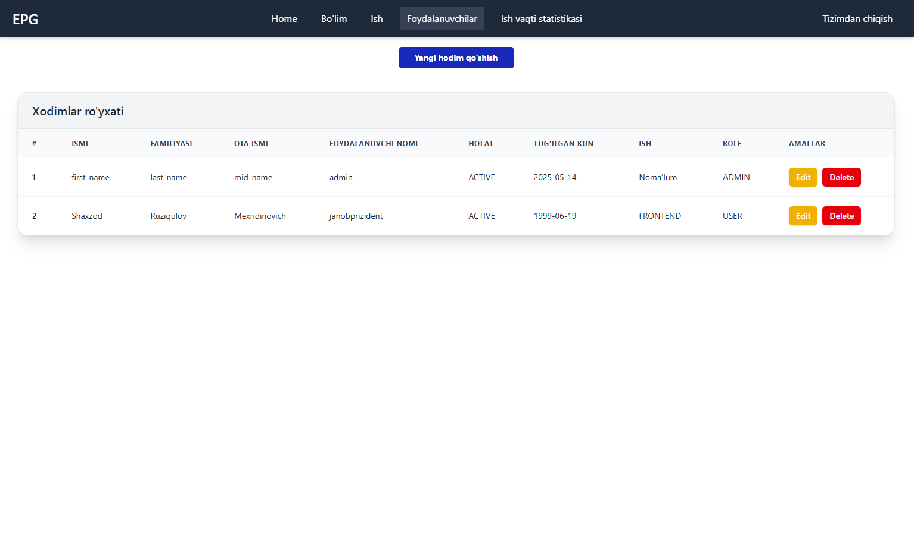
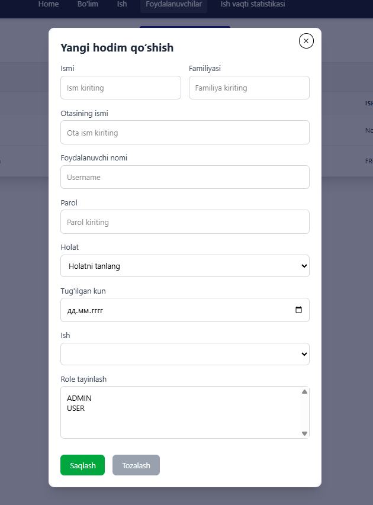
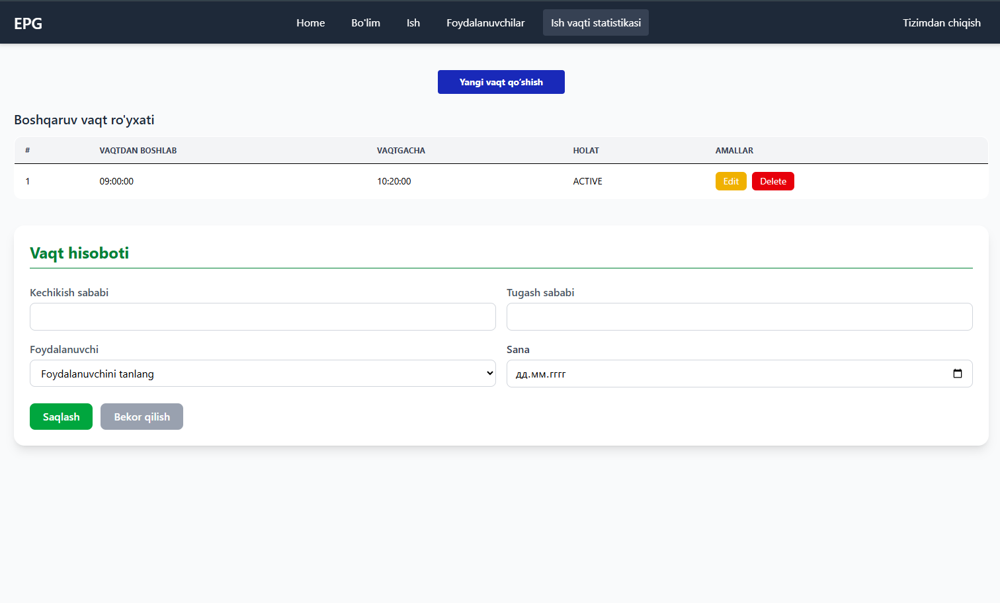
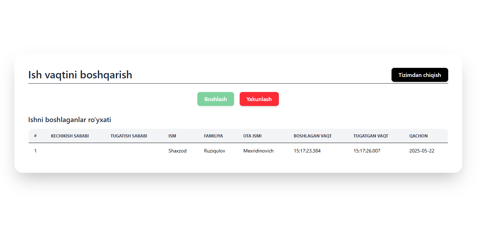

# Office Management
# Ishga Kelish Vaqtini Nazorat Qilish Tizimi - Frontend

Bu frontend loyiha hodimlar ishga kelganligini tasdiqlashi, nazoratchi esa ularni kuzatishi uchun yaratilgan. Vue 3 va Tailwind CSS texnologiyalaridan foydalanilgan.

## 🧰 Texnologiyalar
- Vue.js 3 (Composition API)
- Vue Router
- Axios
- Tailwind CSS
- Pinia (holat boshqaruvi uchun)

## 📦 Funksionallik
- Hodim ishga kelganda kelganligini bildiradi
- Kechikishlar avtomatik aniqlanadi
- Dashboard uchun statistik API’lar mavjud
- Telegram xabarnoma yuborish tizimi (planlashtirilmoqda)

## Mavjud saxifalar(admin uchun)
- home page

- Bo'lim tayinlash

- Ish(vakansiya) yaratish

- Foydalanuvchi yaratish


- Ish vaqt statistikasi
- 
## User uchun
-

## ⚙️ O‘rnatish
```bash
git clone https://github.com/your-org/attendance-system-frontend.git
cd attendance-system-frontend
npm install
npm run dev